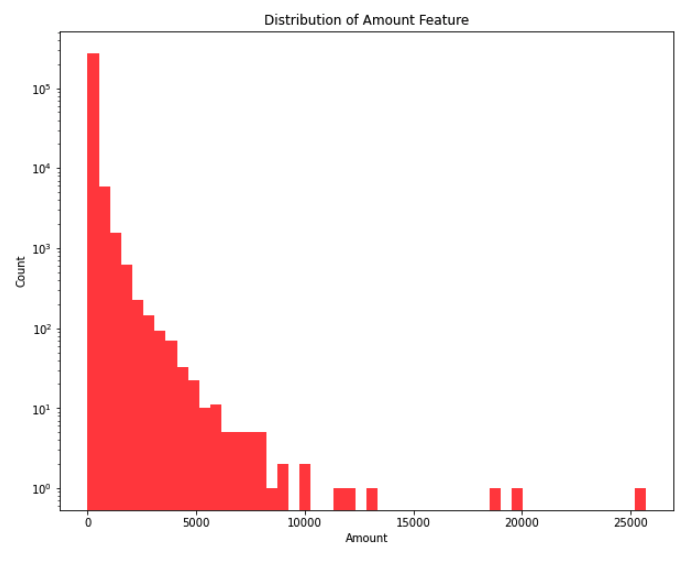
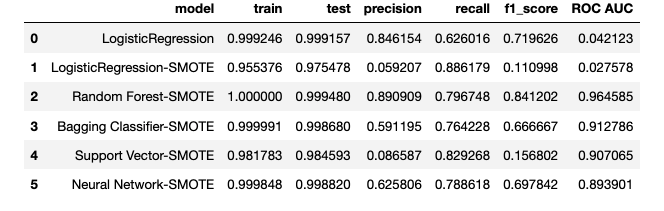
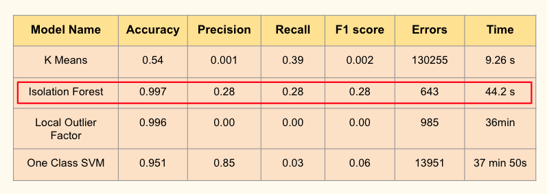

# Project: Credit Card Anomaly Detection
 .

 ## Contents
 
- [Problem Statement](#Problem-Statement)  
- [Background](#Background)
- [Challenges in ML training](#Challenges-in-ML-training)
- [Data Analysis and Modeling](#Data-Analysis-and-Modeling)
- [Conclusions](#Conclusions)
- [Next Steps](#Next-steps)

## Problem Statement

The goal of this project is to Detect Anomalies in credit card transactions. Machine learning algorithms are being developed to detect fraudulent credit card transactions. 
We will be using the following algorithms for Anomaly detection in this project and then compare their performances:
1. Supervised Learning models
    - Random Forest
    - Bagging Classifiers
    - Logistic Regression
    - Support Vector Machines
    - Neural Networks
    
2. Unsupervised Learning models
    - K-Means Clustering
    - Isolation Forest
    - Local Outlier Factor
    - One Class SVM

Dataset for this problem is taken from Kaggle Credit Card Fraud Detection ([source](https://www.kaggle.com/mlg-ulb/creditcardfraud)). The dataset contains transactions made by credit cards in September 2013 by European cardholders. The dataset contains 284,807 transactions, 492 of which are fraudulent.  Feature 'Time' contains the seconds elapsed between each transaction and the first transaction in the dataset. The feature 'Amount' is the transaction Amount, this feature can be used for example-dependant cost-sensitive learning. Feature 'Class' is the response variable and it takes value 1 in case of fraud and 0 otherwise. The features of this dataset are already computed as a result of PCA. This helps us in 2 ways:
1. The confidentiality of the user data is maintained.
2. The features in the dataset are independent of each other due to PCA transformation.

The authors also state that they use the behavioural characteristics of the owner of the card, which are shown by a variable representing the spending habits of the customer as well as the month, hour of the day, geographical location and type of merchant. Features V1, V2, … V28 are the principal components obtained with PCA, the only features which have not been transformed with PCA are 'Time' and 'Amount'. Feature 'Time' contains the seconds elapsed between each transaction and the first transaction in the dataset. The feature 'Amount' is the transaction Amount, this feature can be used for example-dependant cost-sensitive learning. Feature 'Class' is the response variable and it takes value 1 in case of fraud and 0 otherwise.

## Background

In recent uears there has been a dramatic increase in the use of credit cards as a means of payment due to their ease of use and convenience. Financial payment service giants like Stripe, Square etc, made credit card payments seamless thus increasing the credit card transactions by multiples every year ([*source*](https://www.creditcards.com/credit-card-news/market-share-statistics/)). Thus also resulting in Credit card fraud reports doubling every year ([*source*](https://www.fool.com/the-ascent/research/identity-theft-credit-card-fraud-statistics/)). More Specifically a transaction is said to be fraudulent when it is committed by an unauthorized party and without the rightful owner and/or relevant institution knowing. 

In these cases, fraudsters could use the card for their personal interests, depleting its resources or until they are caught or the card is blocked. This issue has sparked the interest of both academia and industry, where individuals are working to identify solutions to this problem and to keep up with the ever-changing approaches adopted by malicious players. Credit card fraud detection is now an active field of research, and it particularly hinges on the concept of automation; it is in fact not always feasible or possible to manually review each transaction in order to establish its nature. In addition to this, it is also important to consider that there is another significant human component that could make or break the attempt of a fraudster to successfully exploit a card: the promptness of the cardholders in reporting a stolen, lost or suspiciously used card ([*source*](https://www.sciencedirect.com/science/article/abs/pii/S095741741400089X?via%3Dihub)). This requires the implementation of automated tools for smarter and faster detection of frauds, which has resulted in machine learning techniques being increasingly tested and implemented. 

More broadly, what is Anomaly Detection? Anomaly Detection is the technique of identifying rare events or observations which can raise suspicions by being statistically different from the rest of the observations. Such “anomalous” behaviour typically translates to some kind of a problem like a credit card fraud, failing machine in a server, a cyber attack, etc.([source](https://www.geeksforgeeks.org/machine-learning-for-anomaly-detection/)). Anomaly detection can be done using the concepts of Machine Learning such as:
- **Supervised Anomaly Detection**: This method requires a labeled dataset containing both normal and anomalous samples to construct a predictive model to classify future data points. The most commonly used algorithms for this purpose are supervised Neural Networks, Support Vector Machine learning, K-Nearest Neighbors Classifier, Logistic Regression, etc.
- **Unsupervised Anomaly Detection**: This method is applied on unlabeled data and assumes two things about the data ie Only a small percentage of data is anomalous and Any anomaly is statistically different from the normal samples. Based on the above assumptions, the data is then clustered using a similarity measure and the data points which are far off from the cluster are considered to be anomalies. Commonly used algorithms are K-Means and Isolation Forest, Local Outlier Factor and One Class SVM classifiers.

 
## Challenges in ML training
Some of the common challenges related to training machine learning models for credit card fraud detection are: **Imbalanced dataset**, this is one of the key challenges in relation to training models for detecting credit card fraudulent transactions. In order to tackle the imbalanced data set, SMOTE, a sampling technique is used. In this technique, the minority class i.e credit card fraudulent transactions are oversampled to balance out the dataset of credit cards not being used fraudulently and credit cards which are used fraudulently. SMOTE (Synthetic Minority Over-sampling Technique) technique can be used to generate new credit card examples by using the nearest neighbors of minority class credit cards. Another technique which can be used to creating balanced dataset is by leveraging K-means clustering and the genetic algorithm to create new data samples for minority clusters to create a balanced dataset.  
In this project we will be using the SMOTE technique to tackle the unbalanced data.

 
## Data Analysis and Modeling
The dataset was already cleaned and did not need much preprocessing. Basic EDA showed Shape of the dataset was around 20400 transaction rows with 31 features. Out of which Class feature had 473 Fraud transactions represented as class -1 or in this case called the positive class. The one main thing you will notice about this data is that — The Fraud transactions was 0.17% of the total. Making the dataset imbalanced. Which seems pretty valid for such kind of data. Imbalanced datasets greatly hinders the performance of supervised learning. And we have to apply balancing techniques in order to model under supervised models. We’ll look at that in a moment. Also we can clearly notice from the stats, the average Money transaction for the fraudulent ones are more. This makes this problem crucial to deal with. 
Next looking the distribution of Time and Amount feature, the feature 'Time' contains the seconds elapsed between each transaction and the first transaction in the dataset. Time is bimodal as you can see since the transactions are over a period of 2 days. Most number of transaction occur during the day than night. This feature does not tell much cause they seem like they are normal transactions. The Amount feature distribution had right skewed distribution. The mean of all credit card transactions in this data set was 88. The largest amount in transaction around 25000. Most of the transactions were small amounts.
 

 

 
### Modeling
Before applying **Supervised Learning models** to the dataset, we have to address the issue of imbalance because most machine learning techniques will have poor performance on the minority class, and in this case the minority class is most important. 
We used to SMOTE technique to balance the data and synthetically create datapoints. The dataset was then split into training and testing sets.  
Various models under Supervised Learning (Logistic Regression, Random Forest, Bagging Classifier, SVM, Neural Networks) and under the Unsupervised Learning models, KMeans, Local Outlier Factor, Isolation Forest and One-Class SVM models were executed on the credit card dataset to determine fraud and non-fraud transactions and accuracy of analytical model is evaluated with help of confusion matrix. The models are evaluated based on parameters such as precession, recall, accuracy and F1 score and the computation time. Since test data is highly imbalanced we cannot look only at the accuracy scores.Recall and ROC AUC scores are important. 

     
## Conclusions
Various Supervised models were run on credit card fraud dataset and accuracy of analytical model. More emphasize will be given on recall in order to capture as many fraudulent cases as possible. The only catch here is the data that we have received for model training the data features are the transformed version of PCA. If the actual features follow a similar pattern then we are doing great!! 
Since test data is highly imbalanced we cannot look only at the accuracy scores.Recall and ROC AUC scores are important. 
- Random forest gave better recall (80%) and ROC AUC (96%) scores compared to the other models. 
- The model predicted that 25 fraudulent transactions were not fraud and predicted 12 cases were fraud when they were not fraudulent.
- Random forest also had a least computation time (8min 19s).

 
Under the Unsupervised Learning models, KMeans, Local Outlier Factor, Isolation Forest and One-Class SVM models were executed on the credit card dataset to determin fraud and non-fraud transactions: 
- Isolation Forest detected 643 errors versus Local Outlier Factor detecting 985 errors and 13951 in One Class SVM, KMeans had error 130255 (classified non fraud data as fraud transactions)
- Isolation Forest has a 99.74% more accurate than LOF of 99.65% and SVM of 95.1%
- When comparing error precision & recall for 3 models , the Isolation Forest performed much better than the LOF, SVM and KMeans as we can see that the detection of fraud cases is around 28 % versus LOF detection rate of just 0 for LOF and SVM of 2%.
- Finally the model computation time was also better than the rest of the models(44secs). It too fairly less time than SVM and LOF.
- So overall Isolation Forest Method performed much better in determining the fraud cases which is around 28%.
- We can conclude saying that Isolation forest and Random forest is a better anomaly detection algorithm than the others for the given data set.

 

## Next steps
The credit card fraud detection is becoming important topic of research, as different types of attacks are increasing
at an alarming rate. In this notebook we have proposed a framework to process large volume of data, the
functionality of framework can be extended to extract real time data from different desperate sources. The extracted
data is then used to build strong analytical model. These analytical models are run on credit card dataset and
accuracy of analytical model is evaluated with help of confusion matrix. Among the all models, random forest and Isolation Forest performed best in terms of accuracy, precision and recall. To complete the training cycle, the model parameters could be optimized — as for all classification solutions. We have omitted this part in this project, but it could easily be introduced. For a random forest, this means finding the optimal number of trees and tree depth for the best classification performance.
 
 
## Resources
1. https://vitalflux.com/credit-card-fraud-detection-machine-learning/
2. https://arxiv.org/pdf/2108.10005v1.pdf 
3. https://towardsdatascience.com/local-outlier-factor-for-imbalanced-classification-cbced8f84baf
4. https://www.bmc.com/blogs/machine-learning-anomaly-detection/
5. https://www.geeksforgeeks.org/local-outlier-factor/

