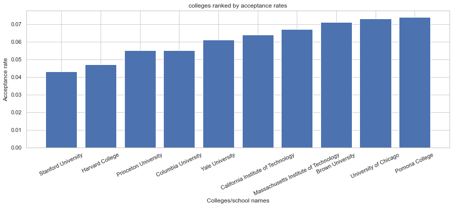
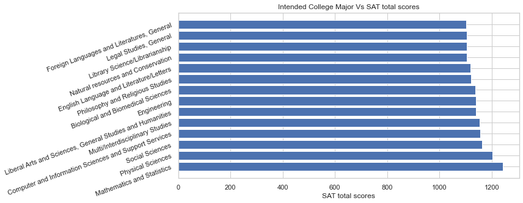

# Project 1: Standardized Test Analysis
# Analysis of SAT & ACT datasets for 2019 and a peek into the test-optional admissions criteria
 .

 ## Contents:
 
- [Problem Statement](#Problem-Statement)  
- [Data](#Data)
- [Data Dictionary](#Data-Dictionary)
- [Outside Research](#Research)
- [Data Analysis](#Data-Analysis)
- [Conclusions and Recommendations](#Conclusions-and-Recommendations)

## Problem Statement:

High school students often know which colleges they would like to consider, but rarely know what SAT or ACT score they should aim for when applying to these colleges. This project aims to explore the relation between 
1) the SAT score and the College Majors 
2) trends in SAT and ACT participation for the year 2019  

What we would also like to see here is: Is there a relation between the number of applicants and the acceptance rates. How does the college prestige and acceptance rate relate. Will the test-option decision help the admission boards to evaluate the students based on GPA and overall achievements and not just a single test? 
    
  

## Background:

Standardized tests have long been a controversial topic for students, administrators, and legislators. Since the 1940's, an increasing number of colleges have been using scores from sudents' performances on tests like the SAT and the ACT as a measure for college readiness and aptitude ([*source*](https://www.minotdailynews.com/news/local-news/2017/04/a-brief-history-of-the-sat-and-act/)). Supporters of these tests argue that these scores can be used as an objective measure to determine college admittance. Opponents of these tests claim that these tests are not accurate measures of students potential or ability and serve as an inequitable barrier to entry.

Increasing number of universities are dropping SAT and ACT requirement for fall of 2021 admissions in response to the coronavirus pandemic.([source](https://www.cnn.com/2020/04/14/us/coronavirus-colleges-sat-act-test-trnd/index.html))Some of them announced it's going test-optional. This decision could benefit a lot of people: those students who no longer have access to test prep and other resources, schools can get more applicants and a more diverse pool of applicants, students will have the opportunity to be evaluated by more than just a score.

"Pre-pandemic there were 1,070 schools that were test-optional – one of whom was test-blind. Now there are 1,686, including 68 that are test-blind for fall 2021," says Robert Schaeffer, interim executive director of FairTest.([*source*](https://www.usnews.com/education/best-colleges/articles/how-the-coronavirus-is-pushing-colleges-to-go-test-optional)) What Test-Optional Means for Students: test-optional means students are not required to submit standardized test scores on their college admissions application, whether to do so is up to the student. Test-blind means that colleges won't look at scores even if a student submits them.

In this project we will look for trends or relations between the acceptance/participation rates and SAT/ACT scores of 2019, and SAT scores for intended majors. We would also like to see how the acceptence rates fare for the prestigious schools. There are many criterias that makes an educational institution prestigeious, the Reputation, Selectivity, Funding, Faculty and more. For the sake of this project, we will be looking closely at the acceptance rates as the Selectivity criteria for the students, lower acceptance rates should correspond to prestigious schools/colleges.  

## Data

* [`act_2019.csv`](./data/act_2019.csv): 2019 ACT Scores by State ([source](https://blog.prepscholar.com/act-scores-by-state-averages-highs-and-lows))
* [`sat_2019.csv`](./data/sat_2019.csv): 2019 SAT Scores by State ([source](https://blog.prepscholar.com/average-sat-scores-by-state-most-recent))
* [`sat_2019_by_intended_college_major.csv`](./data/sat_2019_by_intended_college_major.csv): 2019 SAT Scores by Intended College Major ([source](https://reports.collegeboard.org/pdf/2019-total-group-sat-suite-assessments-annual-report.pdf))
* [`sat_act_by_college.csv`](./data/sat_act_by_college.csv): Ranges of Accepted ACT & SAT Student Scores by Colleges ([source](https://www.compassprep.com/college-profiles/))

## Data Dictionary

|Feature|Type|Dataset|Description|
|:---|:---:|:---:|:---|
|**state**|*object*|2019 Average SAT and ACT Scores by State |State in the United states of America.| 
|**sat_participation**|*float64*|2019 Average SAT Scores by State|The percentage expressed as a float on the number of students enrolled in schools.|
|**sat_reading_and_writing**|*int64*|2019 Average SAT Scores by State |The average English reading and writing score in a maximum score of 800.| 
|**sat_math**|*int64*|2019 Average SAT Scores by State |The average math score in a maximum score of 800.| 
|**sat_total**|*int64*|2019 Average SAT Scores by State |The combined score of sat_reading_and_writing and sat_math.| 
|**act_participation**|*float64*|2019 Average ACT Scores by State|The percentage expressed as a float on the number of students enrolled in schools.|
|**act_composite**|*float64*|2019 Average ACT Scores by State |The average of the 4 ACT scores for the state.| 
|**college_major**|*object*|SAT Participation and Performance:Intended College Major|Intended College Major.| 
|**sat_testtakers**|*int64*|SAT Participation and Performance:Intended College Major|2019 highschool graduates who took SAT during highschool.|
|**accept_rate**|*float64*|SAT Participation and Performance:Intended College Major |The percentage expressed as a float on the number of students that were accepted.| 
|**sat_reading_writing**|*int64*|SAT Participation and Performance:Intended College Major|Mean score of SAT English reading and writing.|
|**sat_math**|*int64*|SAT Participation and Performance:Intended College Major|Mean score of SAT math test.|
|**new_sat_total**|*int64*|SAT Participation and Performance:Intended College Major|The combined score of sat_reading_and_writing and sat_math.|
|**school**|*object*|SAT and ACT Policies and Score Ranges for Popular Colleges and Universities |The names of popular four-year postsecondary institutions in the U.S.|
|**policy_details**|*object*|SAT and ACT Policies and Score Ranges for Popular Colleges and Universities |Admission testing policies for the colleges and universities.|
|**number_of_applicants**|*int64*|SAT and ACT Policies and Score Ranges for Popular Colleges and Universities |Number of applicants for the colleges and universities.|
|**accept_rate**|*float64*|SAT and ACT Policies and Score Ranges for Popular Colleges and Universities |The percentage accepted expressed as a float.|
|**sat_25th & 75th_percentile**|*float64*|SAT and ACT Policies and Score Ranges for Popular Colleges and Universities |Range of SAT scores of enrolled students.|
|**act_25th & 75th_percentile**|*float64*|SAT and ACT Policies and Score Ranges for Popular Colleges and Universities |Range of ACT scores of enrolled students.|
|**test_optional?_No**|*uint8*|SAT and ACT Policies and Score Ranges for Popular Colleges and Universities |Test policy of the school- SAt/ACT is NOT optional.|
|**test_optional?_Yes**|*uint8*|SAT and ACT Policies and Score Ranges for Popular Colleges and Universities |Test policy of the school- SAt/ACT is optional.|
|**test_optional?_Yes (TB)**|*uint8*|SAT and ACT Policies and Score Ranges for Popular Colleges and Universities |Test policy of the school- SAt/ACT is optional and test blind-meaning the policy will be re-evaluated at the end of the applicable period.|
|**test_optional?_Yes (TF)**|*uint8*|SAT and ACT Policies and Score Ranges for Popular Colleges and Universities |Test policy of the school- SAt/ACT is not required or Test Free.|
|**test_optional?_Yes***|*uint8*|SAT and ACT Policies and Score Ranges for Popular Colleges and Universities |Test policy of the school- SAt/ACT is Test Optional for some students and the admittance will be evaluated based on a GPA cut off.|
|**years_applicable_from_2021**|*uint8*|SAT and ACT Policies and Score Ranges for Popular Colleges and Universities |Number of years the test policy of the school is applicable.|

## Outside Research:

Before the pandemic, a growing number of colleges stopped requiring applicants to submit SAT or ACT scores as a way to increase diversity on their campuses. But researchers are finding that the test-optional policy isn’t substantially raising the share of low-income students or students of color at colleges that have tried it.
The latest study, published in the peer-reviewed American Educational Research Journal in April 2021, found that test-optional admissions increased the share of Black, Latino and Native American students by only 1 percentage point at about 100 colleges and universities that adopted the policy between 2005-06 and 2015-16. The share of low-income students, as measured by those who qualify for federal Pell Grants, also increased by only 1 percentage point on these campuses, compared to similar schools that continued to require SAT and ACT scores. 
It will be interesting to see how the diversity of the 2021-22 freshman classes change when all the data are in. The other way to look at this is, if these colleges are picky, it could slow the momentum of test-optional admissions. Colleges had to hire many more admissions staffers and application readers to sift through applications without test scores. Test scores are an efficient way to shortlist the applicant pool. Having said this, will the colleges go test-optional or test-free in the near future? Only time and data will tell! 

([source](https://www.minotdailynews.com/news/local-news/2017/04/a-brief-history-of-the-sat-and-act/))
([source](https://www.cnn.com/2020/04/14/us/coronavirus-colleges-sat-act-test-trnd/index.html))
([source](https://oedb.org/rankings/acceptance-rate/))
([source](https://education.seattlepi.com/university-prestigious-1307.html))
([source](https://hechingerreport.org/proof-points-test-optional-policies-didnt-do-much-to-diversify-college-student-populations/))
([source](https://medium.com/@james.dargan/participation-skews-state-averages-f68969371a01))
([source](https://www.smithsonianmag.com/innovation/has-pandemic-put-end-to-sat-act-180978167/))    

## Data Analysis:

This notebook begins with importing and cleaning the '2019 SAT and ACT scores by US States', 'SAT 2019 and Intended college Major' and 'SAT ACT by colleges' datasets. SAT 2019 and ACT 2019 datasets were merged to create one dataset. 
All the datatypes were recitfied based on the type of variable, for example: percentage values were converted from object to numeric. 
Once cleaned, exploratory data analysis was performed to uncover trends in test scores and participation rates over the US States. 
Reordered the data in 'SAT scores for intended majors' to extract useful information such as most aspired majors for high school students, 
Correlations between the number of test-takers and acceptence rates. Further, data visualizations were made to state our problem statement and findings. 

    
## Conclusions and Recommendations:

Test Averages and Participation Correlate Negatively- for the States that have larger participation, the scores represent the average of the entire student body, thus pulling the state average down. And states that have lower participation rates have average score reflective of only the most high-performing students of the state. SAT total score is most positively correlated to the ACT Participation about 0.67.  SAT total score is negatively correlated to the SAT Participation indicating as SAT participation increases, the total SAT score decreases. When we compared the participation rates for SAT and ACT across the US states, The distributions of the 2 plots seem opposite to eachother.. Meaning that when there is higher SAT participation the ACT participation is low. More states have a 100% ACT participations compared to SAT.
SAT & ACT Scores Correlate Negatively- States that have higher average SAT scores have lower average ACT scores and its the same the other way around.
The spread of the scores for both the SAT and ACT are very similar. Even though the score ranges vary. SAT score ranges from out of 400-1600 and act ranges out of 1-36.

Intended college major indicates that the higher SAT scorers choose majors in STEM related fields.
Students who desire to major in Science and Math statistics, Engineering and techology or Multi/Interdisciplinary Studies should score higher than 1100 in SATs The acceptance rate for Health Professions and related Clinical Sciences and Business, Management, Marketing and Engineering are the highest. The rates coincide proportionally with the SAT testtakers. Higher the testtakers higher is the acceptence rate. Students with highest average SAT math scores see themselves as future Mathematicians and statistics Majors

The ACT and SAT 75th percentile scores for the enrolled students and acceptance rates for the new admits are inversely proportional. Acceptance rates decrease as scores increases. We can further state that the colleges with high scores and low acceptance rates are among the prestigious colleges. Meaning the more competitive a school is the higher and narrower is the margin of test scores. The pandemic forced a larger number of universities to go test-optional, leaving them no-choice but to experiment this option. And due to this many schools will recieve larger number of applicants and from a broader pool and more diverse applicants. In addition to a strong academic record, these colleges will also look for well-rounded applicants who bring something unique to the student body. Highlighting extracurricular activities.
It is upto the colleges to evaluate how the test-optional admissions will benefit them before reconsidering the value of the tests. This means looking at all the data before and after.

