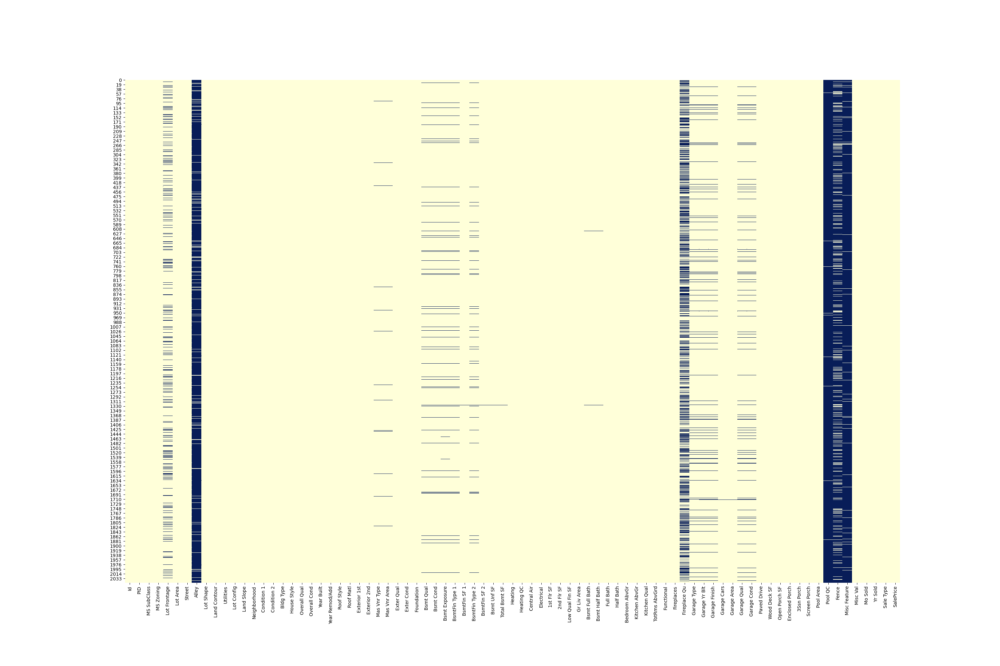
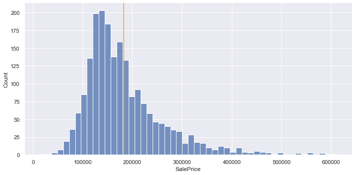
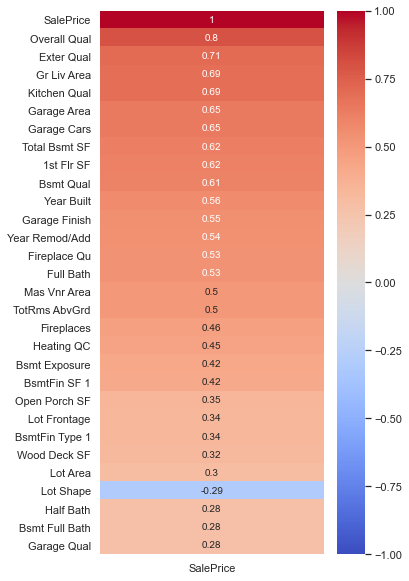
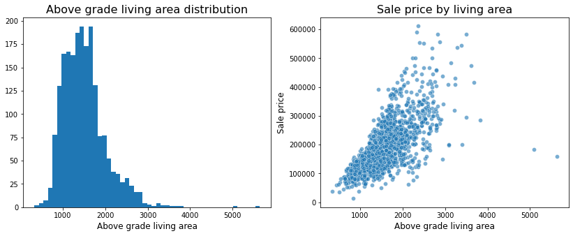

# Project 2: Predicting house Sale Prices in Ames, Iowa

### Contents:
- [Problem Statement](#Problem-Statement)
- [Data Dictionary](#Data-Dictionary)
- [Analysis Approach Outline](#Analysis-Approach-Outline)
    -[01_EDA and Train Data Cleaning](#01_EDA-and Train-Data-Cleaning)
    -[02_Visualizations and Preprocessing](#02_Visualizations-and-Preprocessing)
    -[03_Test Data Cleaning and preprocessing](#03_Test-Data-Cleaning-and-preprocessing)
    -[Modeling](#Modeling)
- [Conclusions and Next steps](#Conclusions-and-Next-steps)

## Problem Statement

The Ames Housing dataset contains all residential home sales in Ames, Iowa between 2006 and 2010. The data set contains many explanatory variables on the quality and quantity of physical attributes of residential homes in Iowa sold between 2006 and 2010. Most of the variables describe information a typical home buyer would like to know about a property (square footage, number of bedrooms and bathrooms, size of lot, etc.). This project aims to find out what drives the price of a house- Is it the neighborhood? The size of the house? The amenities? Or something else?

## Data Dictionary

|Feature|Type|Dataset|Description|
|:---|:---:|:---:|:---|
|**Id**|*int64*|ID of the house| 
|**PID**|*int64*|Parcel Identification Number.|
|**Lot_Frontage**|*float64*|Linear feet of street connected to property| 
|**Lot_Area**|*int64*|Lot size in square feet|
|**Land_Slope**|*int64*|Slope of property|Ordinal| 
|**Overall_Qual**|*int64*|Rates the overall material and finish of the house|Ordinal|
|**Overall_Cond**|*int64*|Rates the overall condition of the house|Ordinal|
|**Year_Built**|*int64*|Original construction date|Discrete|
|**Mas_Vnr_Area**|*float64*|Masonry veneer area in square feet| 
|**Exter_Qual**|*int64*|Evaluates the quality of the material on the exterior|Numeric: Ex':5, 'Gd':4, 'TA':3, 'Fa':2, 'Po':1|
|**Exter_Cond**|*int64*|Evaluates the present condition of the material on the exterior|Numeric: Ex':5, 'Gd':4, 'TA':3, 'Fa':2, 'Po':1|
|**Bsmt_Qual**|*int64*|Evaluates the height of the basement|Numeric: Ex':5, 'Gd':4, 'TA':3, 'Fa':2, 'Po':1|
|**Bsmt_Cond**|*int64*|Evaluates the general condition of the basement|Numeric: Ex':5, 'Gd':4, 'TA':3, 'Fa':2, 'Po':1|
|**Bsmt_Exposure, FireplaceQu**|*int64*|Refers to walkout or garden level walls, Fire place quality|Numeric:'Gd':4, 'Av':3, 'Mn':2, 'No':1,'NA':0 |
|**BsmtFin_Type_1 and 2**|*int64*|Rating of basement finished area|Numeric:'GLQ':6, 'ALQ':5, 'BLQ':4, 'Rec':3, 'LwQ':2, 'Unf':1, 'NA':0|
|**BsmtFin_SF_2**|*float64*|Type 1 finished square feet|Continuous|
|**BsmtFin_SF_2, 1, Unf**|*float64*|Type 1, type 2, unfinished, finished square feet|Continuous|
|**Heating_QC**|*int64*|Heating quality and condition|Numeric: Ex':5, 'Gd':4, 'TA':3, 'Fa':2, 'Po':1|
|**Central_Air**|*int64*|Central air conditioning|Binary: Y:1, N:0 |
|**Electrical**|*int64*|Evaluates the height of the basement|Numeric: Ex':5, 'Gd':4, 'TA':3, 'Fa':2, 'Po':1|
|**KitchenQual**|*int64*|Kitchen quality|Numeric: Ex':5, 'Gd':4, 'TA':3, 'Fa':2, 'Po':1|
|**Functional**|*int64*|Home functionality (Assume typical unless deductions are warranted)|Numeric:''Typ':7, 'Min1':6, 'Min2':5, 'Mod':4, 'Maj1':3, 'Maj2':2, 'Sev':1, 'Sal':0 |
|**Garage Type**|*int64*|Garage location|dummy column|
|**Garage Finish**|*float64*| Interior finish of the garage|Numeric: 'Fin':3, 'RFn':2, 'Unf':1, 'NA':0|
|**Garage Qual, Garage Cond**|*float64*|Garage quality and Condition|Numeric: 'Ex':5, 'Gd':4, 'TA':3, 'Fa':2, 'Po':1, 'NA':0|
|**Paved_Drive**|*int64*|Paved driveway|Numeric: 'Y':3, 'P':2, 'N':1|
|**Age**|*int64*|Age of the house| 
|**Other_Rooms**|*int64*|Number of rooms other than bedrooms above grade|
|**Garage_area/car**|*float64*|Garage Area per car|continuous|
|**Neighb_Qual**|*int64*|Neighborhood based on quality|ordinal numeric|
|**Land_Contour**|*int64*|Flatness of the property|dummy numeric|
|**MS_Zoning**|*int64*|Identifies the general zoning classification of the sale.|dummy column|
|**Condition1 and 2**|*int64*|Proximity to various conditions|Dummy numeric|
|**Bldg_Type**|*int64*|Type of dwelling|dummy column|
|**Roof_Style**|*int64*|Type of roof|dummy column|
|**is_Remodeled**|*int64*|Was teh house remodeled|Binary |
|**Foundation**|*int64*|Type of foundation|dummy column|
|**Lot_Config**|*int64*|Lot configuration|dummy column|

## Analysis Approach Outline

My approach for this analysis is to separate sections out into separate notebooks for EDA, Data_cleaning, Visualizations, Feature Engineering and Modeling 

### 01_EDA and Train Data Cleaning 
Given are 2 Datasets (Train and test) for the city of Ames, Iowa, USA. There were 81 features on 2051 homes sold in Ames, IA from 2006 to 2010. We first started by looking for the missing values in the train dataset. The dataset required a substantial amount of cleaning. It became apparent that many of the categorical features used NaN as a value. For these features, NaN was mapped to NA (not applicable). These features were updated their NaN values with an appropriate string value. Appropriate values based on other features were inferred for the majority of the remaining NaN values. Dropped those variables with more than 90% null values(Alley, Pool QC, Misc Feature), Lot Frontage missing values were imputed by using the median values for the respective neighborhoods that particular house is in.
Many of the columns were not accurately represented as either numeric or categorical. Non-ordinal columns were changed to categorical and ordinal categorical columns were changed to numerics (such as quality scales for pool, fireplaces, garages, etc.). 

### 02 Visualizations and Preprocessing
Some visualitions helped to decide the type of a particular variable. 
Looking at the distribution of sale price, our target variable. From the histogram below, it becomes apparent that its distribution is skewed right. This makes sense, since less people are buying expensive homes. Features with the strongest linear relationship with sale price by calculating  Pearson's correlation values were looked at.  Overall quality, Above Grade living Area, exterior quality, kitchen quality, Basement square feet, basement quality, year built,garage finish, fireplace quality, and masonry veneer area have the strongest linear relationship with sale price. From these top features, we can see that many of them are related, such as exterior quality and overall quality. This is the first hint that our data might have a high degree of multicollinearity.

Histograms and scatter plots were made for the numerical data like the Grade living area, Garage Area, Total basement SF, 1st Floor SF and 2nd Floor SF and Lot area, they all showed a right skewed distribution just like the the target variable. There were many outliers but were left in the dataset as this could be valuable in the accuracy of the model later especially when it predicts the saleprice from unseen data.

### Feature Engineering
Some columns were created like the Age = (year sold - year built), Other rooms = (total rooms above grade-Bedroom above grade),  Garage_area/car = Garage_Area/Garage_Cars
Neighborhoods were binned into ordinal Neighb_Qual column, based on the overall quality and condition, external quality and condition.
Dummy columns were created for the catogorical variables like- MS Zoning, Building type, Foundation, etc.
Binary columns - is_remodeled (whether a house was remodeled or not)

### 03_Test Data Cleaning and preprocessing
The test data had some missing values as well. the missing values were imputed accordingly and the columns were matched to the train dataset.

### 04_Modeling
For modeling we used Linear, LASSO and Ridge regression to analyze our data. Linear regression helps us understand how is the sale price of a house affected by the total square footage of the house. In linear regression the coefficients are easily interpretable but can be hard to tell which features are the most important. For this Lasso regression was used to narrow down the number of coefficients and then feed those features back into a linear regression model to interpret those features.

K-fold cross validation was performed to get a baseline model score and with these features we looked at Linear Regression, Lasso, Ridge Regression models and how they performed across various features. Each model was scored using the same metrics- R2 and RMSE. Most of the time the 3 models did not vary much from eachother. 

For feature selection we manually choose those features in our data that contribute most to the target variable. In other words we choose the best predictors for the target variable. Here, a heat map was used to rank the features by how correlated they are with the sale price.

We also tried the Logarithmic transformation of the target variable-this is a convenient means of transforming a highly skewed variable into a more normalized dataset. Only the target variable (sale price) was noramlized, which improved our model.

Throughout the project, a number of submissions were prepared for the kaggle competitions. The majority of the time spent on this project was spent cleaning and iterating models with the intention of submitting them to kaggle, these models have been scaled and transformed,

## Conclusions and Next steps
Based on this model we can conclude that the following have the greatest impact on the potential Sale Price of a home in Iowa:
- 1st FLoor and 2nd Floor area( total above grade living area), 
- Age, 
- Basement Finish, 
- Overall quality, Overall Condition, 
- Lot area
- Functional, 
- Neighborhood , 
- Garage Car capacity
- Kitchen quality  and external quality

For data cleaning and imputation, the most important thing was to identify the categorical variables and numeric variables. The variable like MS SubClass is a numerical data type, but it actually is a categorical variable. For feature engineering, the data normality for target variables is important to prediction accuracy.

For next steps, I would like to further refine my model in a few different ways. I would do additional feature engineering to consolidate and reduce number of features. My final model used around 90 features, which is still relatively high, indicating that the model might be too complex. I would also like to optimize algorithm hyperparameters using a GridSearch. Lastly I would like to explore using different algorithms such as XGBoost, Random Forest, etc.

## References:
[1] http://jse.amstat.org/v19n3/decock/DataDocumentation.txt
[2] https://towardsdatascience.com/what-and-why-behind-fit-transform-vs-transform-in-scikit-learn-78f915cf96fe
[3] https://pandas.pydata.org/docs/reference/api/pandas.melt.html
[4] http://nationalappraiserroster.com/Resources/Appraising101/UnderstandingMeasurementsRoomCounts/tabid/223/Default.aspx
[5] https://www.rochesterrealestateblog.com/what-factors-influence-the-sale-price-of-a-home/
[6] https://stackoverflow.com/questions/52472757/creating-a-boxplot-facetgrid-in-seaborn-for-python

